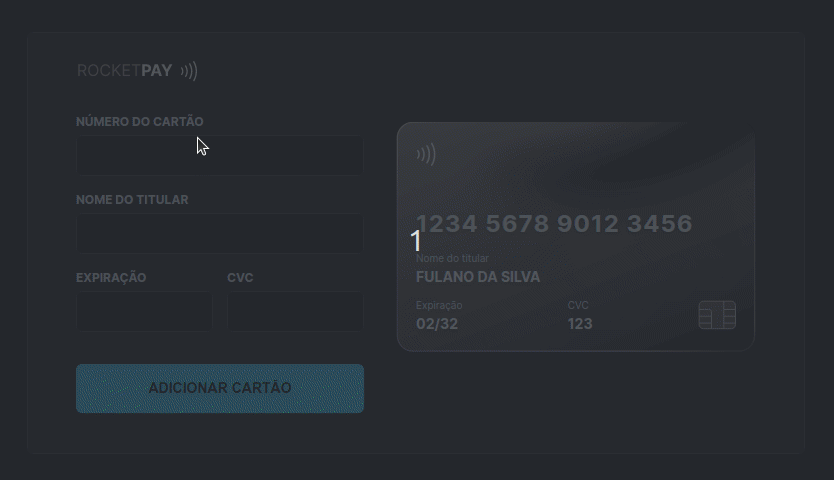

<h1 align="center">
    <a href="https://paulomvrech.github.io/explorer-lab-01/" target="_blank">Explorer Lab #01 - RocketPay</a> 💳
</h1>

## 💻 Sobre o projeto

O Rocketpay é um componente que simula o formulário de preenchimento de cartão de crédito, onde é possível adicionar máscara aos inputs e atualizar elementos HTML via DOM.

---

## 👀 Demo

- Versão Desktop
<div align="center">
    
</div>

---

## 🚀 Tecnologias utilizadas

Esse projeto foi desenvolvido utilizando as seguintes tecnologias:

- [HTML5](https://developer.mozilla.org/pt-BR/docs/Web/HTML)
- [CSS3](https://developer.mozilla.org/pt-BR/docs/Web/CSS)
- [Javascript](https://developer.mozilla.org/pt-BR/docs/Web/JavaScript)
- [Node.js](https://nodejs.org/en/)
- [NPM](https://www.npmjs.com/)
- [Vite](https://vitejs.dev/)
- [iMask](https://imask.js.org/)

---

## 🛠 Como executar o projeto em sua máquina

```bash

# Clone este repositório
$ git clone https://github.com/paulomvrech/explorer-lab-01.git

# Acesse a pasta do projeto no seu terminal/cmd
$ cd explorer-lab-01

# Inicie a aplicação
$ npm run dev

# Acesse o endereço mostrado em seu navegador:
http://localhost:5173

```

---

<p align="center">Desenvolvido por 👏 Paulo Muller Vrech</p>
